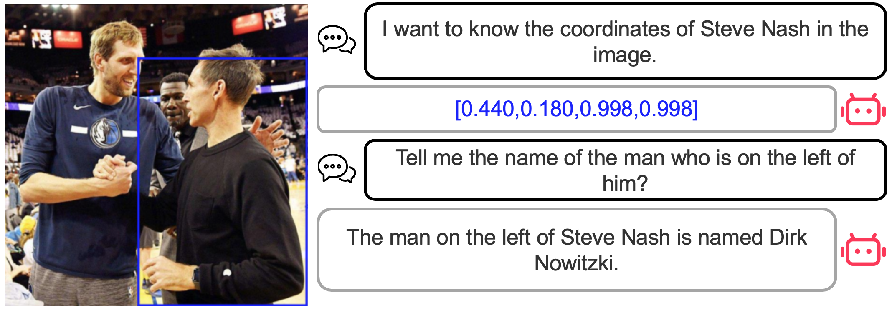

# Pink
Pink: Unveiling **The** Po**w**er of Referential Comprehension for Multi-mod**a**l **LL**Ms. The paper now is available at https://arxiv.org/abs/2310.00582. Codes will be released soon.

<div align="center">
  


</div>

- Visual Encoder: ViT-L/14
- Pre-trained LLM: Vicuna-7B

## Referential Comprehension Case
<div align="center">
  


</div>


## Citations
If you find our work useful for your research, please cite our paper:

```
@misc{xuan2023pink,
      title={Pink: Unveiling the Power of Referential Comprehension for Multi-modal LLMs}, 
      author={Shiyu Xuan and Qingpei Guo and Ming Yang and Shiliang Zhang},
      year={2023},
      eprint={2310.00582},
      archivePrefix={arXiv},
      primaryClass={cs.CV}
}
```
## Contact me
If you have any questions about this work, feel free to contact me at
shiyu_xuan@stu.pku.edu.cn.
